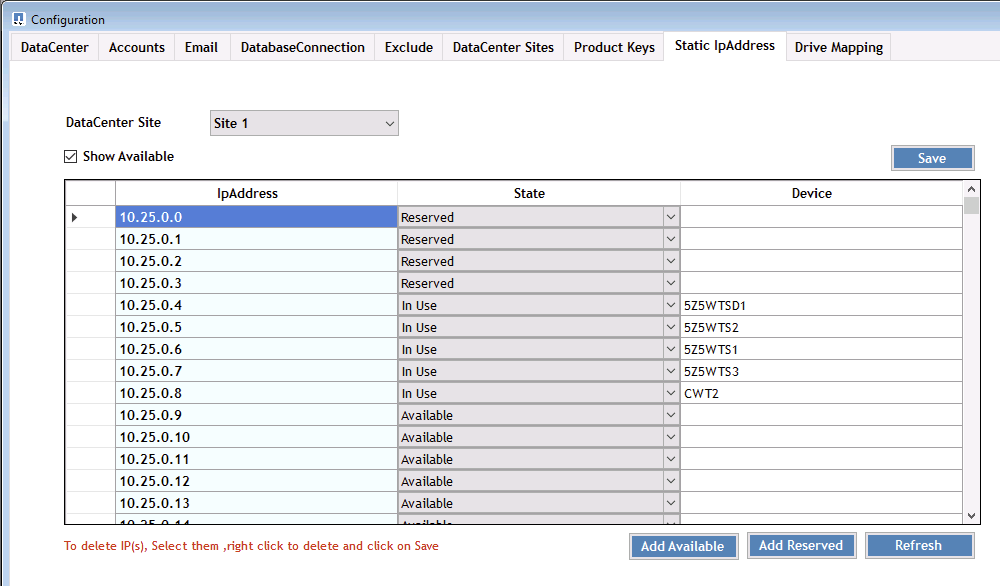

= 개요

== 개요

DCConfig는 많은 배포 전체 설정을 설정 및 변경하는 데 사용되는 CWMGER1 VM의 구성 유틸리티입니다.

. CWMGER1 VM에 admin으로 연결합니다
. 바탕 화면 바로 가기에서 응용 프로그램을 실행합니다

응용 프로그램에는 세 가지 주요 섹션인 구성, 고급 및 도움말이 있습니다.

=== 설정

구성 창이 시작되면 열리며 여러 개의 하위 섹션이 있습니다

==== 데이터 센터

image::images/Management.dcconfig.dcconfig.overview-61c8f.png[Management.dcconfig.dcconfig.overview 61c8f]

==== 계정

image::images/Management.dcconfig.dcconfig.overview-f34a2.png[Management.dcconfig.dcconfig.overview f34a2]

==== 이메일

image::images/Management.dcconfig.dcconfig.overview-4b3be.png[Management.dcconfig.dcconfig.overview 4b3be]

==== 데이터베이스 연결

image::images/Management.dcconfig.dcconfig.overview-80da7.png[Management.dcconfig.dcconfig.overview 80da7]

==== 제외

image::images/Management.dcconfig.dcconfig.overview-0f30e.png[Management.dcconfig.dcconfig.overview 0f30e]

==== 데이터 센터 사이트

image::images/Management.dcconfig.dcconfig.overview-95b21.png[Management.dcconfig.dcconfig.overview 95b21]

==== 제품 키

image::images/Management.dcconfig.dcconfig.overview-298a0.png[Management.dcconfig.dcconfig.overview 298a0]

==== 고정 IP 주소

==== 드라이브 매핑

image::images/Management.dcconfig.dcconfig.overview-60fd2.png[Management.dcconfig.dcconfig.overview 60fd2]

=== 고급

고급 창에는 이 인터페이스 내에서 편집할 수 있는 값 목록이 표시됩니다.

[cols="33,33,33"]
|===
| 그룹 이름 | 고유 이름 | 값 

| 그룹 이름 | 고유 이름 | 값 

| 서버 생성 | UpdateVMNameWhenRemovedFromCache 를 참조하십시오 | 참/거짓 

| 서버 생성 | 업데이트 방화벽 규칙 | 참/거짓 

| 서버 생성 | WaitAfterRebootMin | 분> 

| 서버 생성 | WaitAfterHypervisorCreateMin | 분> 

| 서버 생성 | WaitAfterSysPrepMin | 분> 

| 서버 생성 | WaitAfterSysPrepFor2008ServersMin | 분> 

| 서버 생성 | GFI 에이전트 경로 |  

| 서버 생성 | 자동 클론 생성 활성화 | 참/거짓 

| 서버 생성 | 회사 OU | String - Companyines OU Name>(회사 OU 이름) 

| 서버 생성 | ThinPrint v11을 설치합니다 | 참/거짓 

| 서버 생성 | 서버 OU | String - Servers OU Name>(서버 OU 이름) 

| 서버 생성 | FsLogix를 설치합니다 | 참/거짓 

| 서버 생성 | 기본 OU를 사용합니다 | 참/거짓 

| 서버 생성 | 최대 스레드 수 | 를 누릅니다 

| 서버 생성 | DNS가 분 단위로 업데이트되도록 기다립니다 | 분> 

| Vdc Tools 버전을 확인합니다 | X분 간격으로 실행합니다 | 분> 

| 일일 조치 | 활성화됨 | 참/거짓 

| 일일 조치 | 시작할 때 실행합니다 | 참/거짓 

| 보고서 생성 | 시간 | 시간 00:00> 

| 일일 유지 보수 | 활성화됨 | 참/거짓 

| 일일 유지 보수 | 시간 | 시간 00:00> 

| 주간 유지 보수 | 활성화됨 | 참/거짓 

| 주간 유지 보수 | 시간 | 시간 00:00> 

| 주간 유지 보수 | 일 | 요일> 

| 자동 리소스 할당 | 활성화됨 | 참/거짓 

| 자원 할당 | 데이터 센터 기본값 사용 | 참/거짓 

| 전자 메일 보고서 | IncludeEmailAttachment 를 참조하십시오 | 참/거짓 

| 서버 하트비트 | 간격(분) | 분> 

| AutoPro 데이터를 다운로드합니다 | 간격(분) | 분> 

| 데이터 센터 하트비트 | 간격(분) | 분> 

| 서버가 재부팅됩니다 | 활성화됨 | 참/거짓 

| 서버가 재부팅됩니다 | 재부팅 간격(분 | 분> 

| FreeSpaceReport를 참조하십시오 | MinFreeSpaceGB | GB 최소 임계값> 

| 맥스부트 TimeSpanHours | 클라이언트 서버 | 필요한 재부팅 전 <#시간> 

| 맥스부트 TimeSpanHours | 인프라서버 | 필요한 재부팅 전 <#시간> 

| VDC 도구를 자동으로 업데이트합니다 | 활성화됨 | 참/거짓 

| ActivateOffice 를 참조하십시오 | 활성화됨 | 참/거짓 

| ActivateWindows | 활성화됨 | 참/거짓 

| 모니터링 | 최대 보존 일 수 | days>(<#days>) 

| 로그 | 최대 보존 일 수 | days>(<#days>) 

| 보고서 데이터 | 최대 보존 일 수 | days>(<#days>) 

| 파일 감사 | 최대 보존 일 수 | days>(<#days>) 

| 파일 감사 | 상세 로깅 | 참/거짓 

| FileAuditFolders 를 선택합니다 | NumFolders | 2 

| FileAuditFolder1 | 경로 | [DataDrive]:\Data 

| FileAuditFolder1 | 제외 | thumb.db입니다 

| FileAuditFolder1 | 제외 | *.tmp 

| FileAuditFolder1 | 제외 | * ~$ *.doc 

| FileAuditFolder1 | 제외 | * ~$ *.docx 

| FileAuditFolder2 를 선택합니다 | 경로 | [DataDrive]:\Home 

| FileAuditFolder2 를 선택합니다 | 제외 | thumb.db입니다 

| CwVmAutomationService 를 참조하십시오 | 서비스 명령줄 인수 |  

| FtpReleaaeAddress 를 참조하십시오 | URL | FTP URL> 

| 워크로드 일정 | X분 간격으로 실행합니다 | 분> 

| 워크로드 일정 | 캐시 회사를 해제합니다 | 참/거짓 

| 백업을 생성합니다 | 활성화됨 | 참/거짓 

| 백업을 생성합니다 | X분 간격으로 실행합니다 | 분> 

| 애플리케이션 모니터링 | 활성화됨 | 참/거짓 

| 펜 | 이니셜 슬레펩두 | 초> 

| 펜 | MustChangePasswordDay 를 참조하십시오 | 강제 PW 재설정에 대한 만료 전 일수> 

|  |  | 암호 재설정 텍스트 문자열> 

| 펜 | 로고 | local.png 로고 경로> 

| 펜 | NumNotifyDays | days>(<#days>) 

| 펜 | 알림1 | 알림 만료 전 <#일> 

| 펜 | 통지2일 | 알림 만료 전 <#일> 

| 펜 | 통지3일 | 알림 만료 전 <#일> 

| 펜 | 알림4 | 알림 만료 전 <#일> 

| 펜 | 통지5 | 알림 만료 전 <#일> 

| 펜 | 알림6 | 알림 만료 전 <#일> 

| 모니터링 | 활성화됨 | 참/거짓 

| 모니터링 | 이메일 경고 보내기 | 참/거짓 

| 모니터링 | 분 동안 서버에 알립니다 | 분> 

| 모니터링 | 분 동안 경고 RAM 높음 | 분> 

| 모니터링 | RAM High %(RAM 높음 %) | RAM % Threshold>(<RAM % 임계값>) 

| 모니터링 | 분 동안 CPU High에 알립니다 | 분> 

| 모니터링 | CPU High %(CPU 높음 %) | CPU % Threshold>입니다 

| 모니터링 | 드라이브 공간이 부족합니다 | 디스크 여유 공간 % 임계값> 

| 클라이언트 지연 삭제 | 분 | 분> 

| 드라이브 를 자동으로 확장합니다 | 활성화됨 | 참/거짓 

| 보안 강화 | 활성화됨 | 참/거짓 

| CwAgent를 도메인 관리자로 실행합니다 | 활성화됨 | 참/거짓 

| 모니터 서버 | SolarWinds 사용 | 참/거짓 

| H5 포털 자동 업데이트 | 활성화됨 | 참/거짓 

| 와일드카드 인증서를 설치합니다 | 인프라 서버 | 참/거짓 

| 회사 생성 | 고유 사이트 | 참/거짓 

| 실시간 배율 조정 | 최소 전원 끄기 지연 | 분> 

| 서버 리소스 보고서 | DNS 확인 | 참/거짓 

| 하이퍼바이저 | 캐시 템플릿 | 참/거짓 

| 상세 로깅 | 실시간 배율 조정 | 참/거짓 

| 상세 로깅 | 라이브 배율 - 서버 상태를 표시합니다 | 참/거짓 

| 상세 로깅 | 워크로드 스케줄링 | 참/거짓 

| 상세 로깅 | 템플릿에서 서버를 생성합니다 | 참/거짓 

| 상세 로깅 | 템플릿 타이밍에서 서버를 생성합니다 | 참/거짓 

| 상세 로깅 | 백업에서 서버를 생성합니다 | 참/거짓 

| 상세 로깅 | 클론에서 서버를 생성합니다 | 참/거짓 

| 상세 로깅 | 템플릿 생성 | 참/거짓 

| 상세 로깅 | 다른 서비스와 통신합니다 | 참/거짓 

| 템플릿 생성 | 수동으로 RunSysPrep | 참/거짓 

| 도메인 컨트롤러 | 이름 | cwmgr1.<domain.com> 
|===
image::images/Management.dcconfig.dcconfig.overview-9c7ac.png[Management.dcconfig.dcconfig.overview 9c7ac]

=== 도움말

로컬 도움말 파일을 엽니다.
